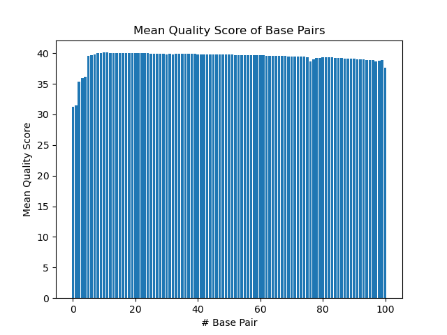
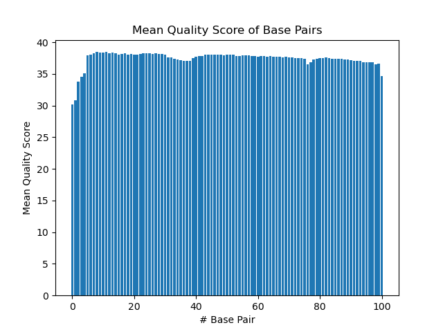
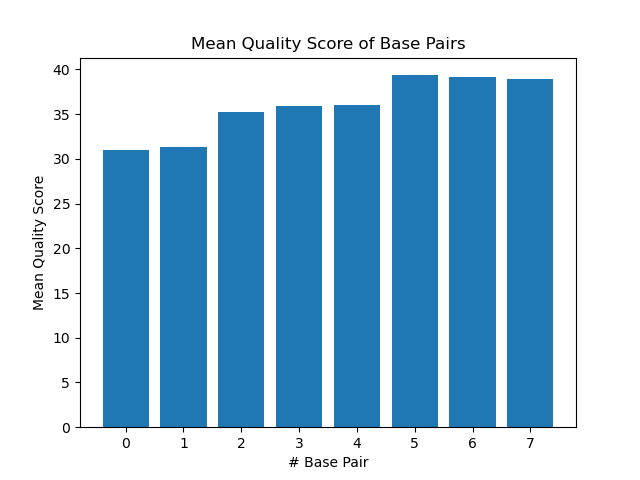

# Assignment the First

## Part 1
1. Be sure to upload your Python script.

| File name | label |
|---|---|
| 1294_S1_L008_R1_001.fastq.gz | Read 1 |
| 1294_S1_L008_R2_001.fastq.gz | Index 1 |
| 1294_S1_L008_R3_001.fastq.gz | Index 2 |
| 1294_S1_L008_R4_001.fastq.gz | Read 2 |

2. Per-base NT distribution
    1.  
    2.  
    3.  
    4.  

    2. ```Index histograms show that 35 cuts out some of the lower index scores while keeping the majority of them. The biological read histograms don't require as much of a strict cutoff since taking care of the indexes' quality will also filter out the corresponding biological reads. For biological reads, 30 is a good cutoff.```
    3. ```
    gunzip -c /projects/bgmp/shared/2017_sequencing/1294_S1_L008_R2_001.fastq.gz /projects/bgmp/shared/2017_sequencing/1294_S1_L008_R3_001.fastq.gz | sed -n "2~4p" | grep -c "N"
    
    7304664
    ```
    
## Part 2
1. Define the problem
2.  ```Index hopping causes some indexes to be swapped, meaning that our data will show the incorrect origin of their sample. Additionally, some indexes have very low quality scores. Both of these need to be filtered out ```
3. Describe output
4. ```There will be 2 files for every category, one from read 1 and one from read 2. Each index will be on category (24 indexes), and there will be a category for swapped indexes and one for low quality indexes.```
5. Upload your [4 input FASTQ files](../TEST-input_FASTQ) and your [>=6 expected output FASTQ files](../TEST-output_FASTQ).
6. Pseudocode
```
Loop through 4 files
	Make 4 lists for each record (one per file)
If N is in the index OR index not in index-list
	Append index to header
	Put in low quality output file
Revcomp function

If indexes are the same
	Append index to header
	Put in index file
Else
	Append index to header
	Put in swap file

Reportnum function


High level functions

Def revcomp(index):
‘’’Takes index, writes complementary strand to it, and then reverses it to get it in 5’ - 3’ direction. Returns the output reverse complement of index.'''
Return statement: Reverse complement string of index
Example input: ACTG
Output: CAGT

Def reportnum(file, category):
‘’’Takes output file and counts the number of read-pairs included in that file’s category. Categories include: “match”, “swap”, “unknown” if the category is swap, function will also return number of unique index combinations.’’’
Return statement: String with number of indexes of chosen category in FASTQ file

Example input: FASTQ file with 5 properly matched indexes, “match”
Output: “5 matched indexes in FASTQ file”
Example input: FASTQ file with 3 swapped indexes (2 same, 1 unique), “swap”
Output: “3 swapped indexes, 2 AAA CCC, 1 AAA TTT”

```
8. High level functions. For each function, be sure to include:
    1. Description/doc string
    2. Function headers (name and parameters)
    3. Test examples for individual functions
    4. Return statement
